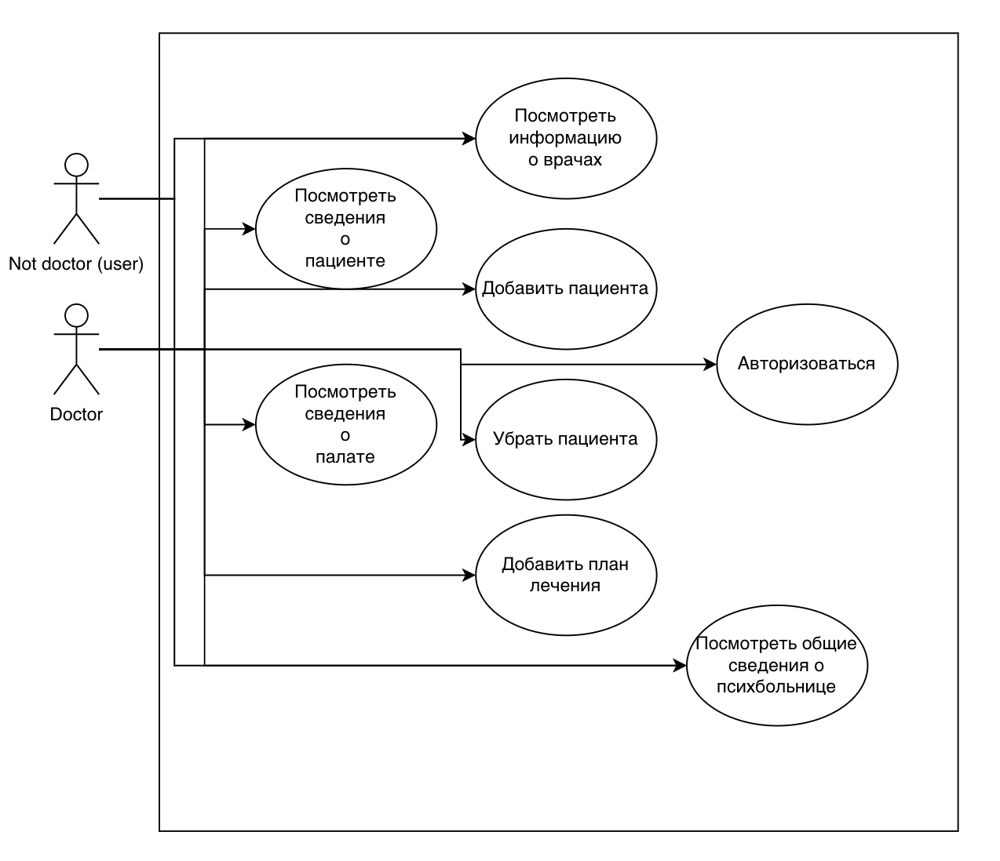
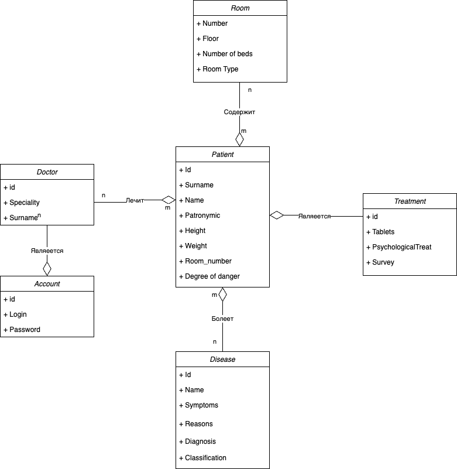
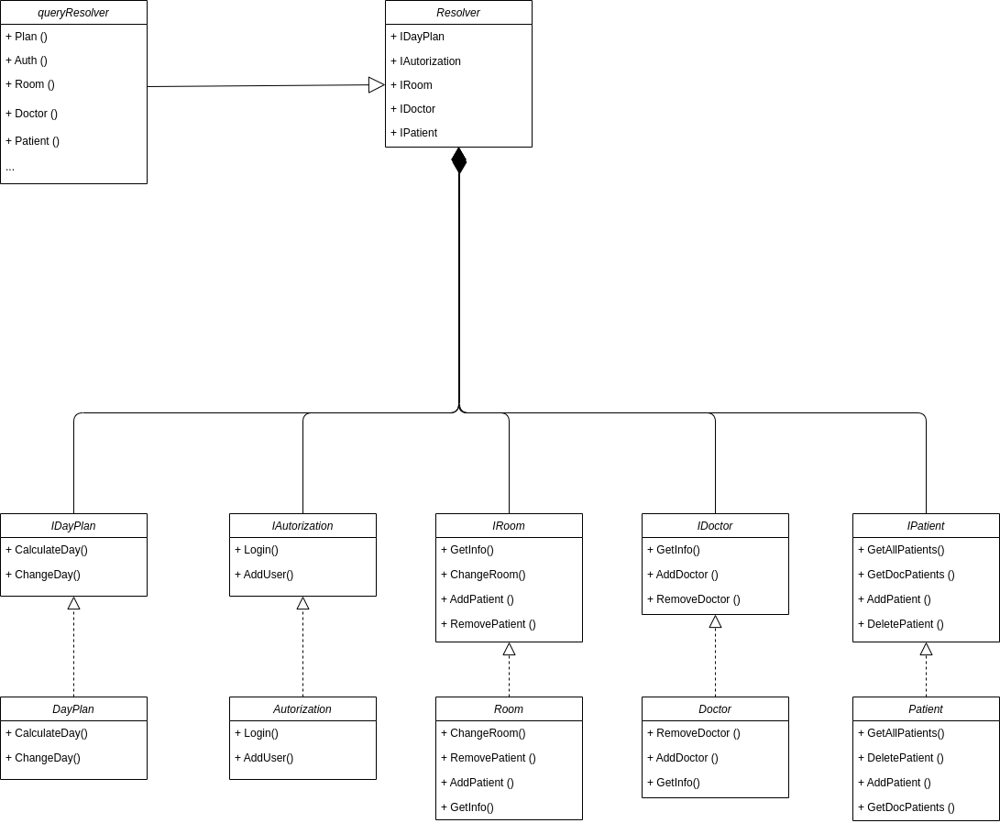
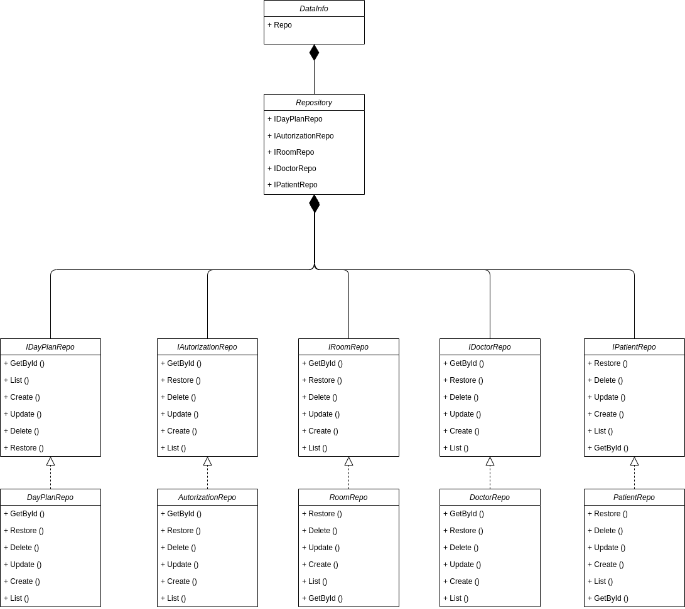

# Лабораторная работа 1

## Название

Псих-Админ

## Цель

Данная система администрирования предназначена для работы с пациентами.
Проект создан для персонала психбольниц.
Данная система будет содержать информацию о пациетах, заболеваниях и лекарствах.

## Use-Case

## ER

## Пользовательские сценарии

Пользователь открывает клиент и может:

1. Посмотреть информацию о себе
2. Добавить пациента к себе
3. Перестать быть лечащим врачом пациента
4. Посмотреть план на день
5. Посмотреть сведения о палате
6. Изменить сведения пациента
7. Посмотреть сведения пациента
8. Посмотреть доступные сценарии
9. Авторизация
10. Вывести всех пациентов больници

## Формализация бизнес-правил, BPMN-диаграмма

## Верхнеуровневое разбиение на компоненты

## UML диаграммы классов

UML диаграмма сущностей системы:

UML диаграмма бизнес логики:

UML компонента доступа к данным:

## Экраны будущего приложения

Страница Главная:

Страница Врача:

Страница Пациента:

                             